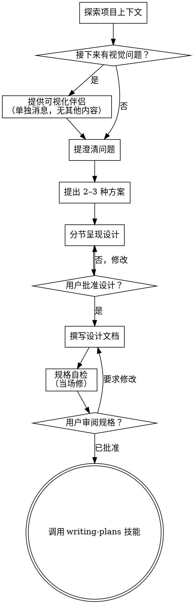

# 把想法头脑风暴成设计

通过自然协作对话，帮助把想法变成完整的设计与规格。

先理解当前项目上下文，然后**每次只问一个问题**来细化想法。一旦清楚要造什么，呈现设计并取得用户批准。

<HARD-GATE>
在呈现设计且用户批准之前，**不要**调用任何实现类技能、写任何代码、搭任何脚手架或采取任何实现动作。无论看起来多简单，**每个**项目都必须经过此流程。
</HARD-GATE>

## 反模式：「这太简单了不需要设计」

每个项目都要走这套流程。待办清单、单函数小工具、改配置——全部算。「简单」项目最容易因未审视的假设而浪费大量工作。设计可以很短（真正简单的项目几句话即可），但**必须**呈现并取得批准。

## 检查清单

你必须为下列每一项创建任务并按顺序完成：

1. **探索项目上下文** — 看文件、文档、近期提交  
2. **提供可视化伴侣**（若话题将涉及视觉问题）— 单独一条消息，不与澄清问题混在一起。见下文「可视化伴侣」。  
3. **提澄清问题** — 一次一个，弄清目的/约束/成功标准  
4. **提出 2–3 种方案** — 含权衡与你的推荐  
5. **呈现设计** — 按复杂度分节，每节后取得用户认可  
6. **撰写设计文档** — 保存到 `docs/superpowers/specs/YYYY-MM-DD-<主题>-design.md` 并提交  
7. **规格自检** — 快速检查占位符、矛盾、歧义、范围（见下）  
8. **用户审阅成文规格** — 请用户在继续前审阅规格文件  
9. **转入实现** — 调用 writing-plans 技能生成实现计划  

## 流程

**终态是调用 writing-plans。** 不要调用 frontend-design、mcp-builder 或任何其他实现技能。头脑风暴之后**唯一**应调用的技能是 writing-plans。

## 过程

**理解想法：**

- 先看当前项目状态（文件、文档、近期提交）  
- 在问细节前评估范围：若请求包含多个独立子系统（例如「做一个含聊天、文件存储、计费与分析的平台」），立即标出。不要在一个本该先拆分的项目上花大量问题抠细节。  
- 若项目过大、不适合单一规格，帮用户拆成子项目：独立模块有哪些、如何关联、应按什么顺序做？然后对**第一个**子项目走正常设计流。每个子项目有自己的 规格 → 计划 → 实现 周期。  
- 对规模合适的项目，一次一个问题细化想法  
- 尽量用选择题，开放式也可以  
- **每条消息只问一个问题** — 若某话题需要多轮，拆成多条问题  
- 聚焦理解：目的、约束、成功标准  

**探索方案：**

- 提出 2–3 种不同方案及权衡  
- 用对话方式呈现选项，给出推荐与理由  
- 先说你推荐的选项及原因  

**呈现设计：**

- 自认已理解要造什么时，呈现设计  
- 每节长度随复杂度：简单则几句话，微妙则可达 200–300 字  
- 每节后问「到目前为止是否合理」  
- 覆盖：架构、组件、数据流、错误处理、测试  
- 若有说不通之处，准备好回头澄清  

**为隔离与清晰而设计：**

- 把系统拆成更小单元，各单元职责单一、通过明确接口通信、可独立理解与测试  
- 对每个单元应能回答：做什么、怎么用、依赖什么？  
- 能否在不读内部实现的情况下理解单元做什么？能否改内部而不破坏调用方？若不能，边界需加强。  
- 更小、边界清晰的单元也更容易协作——你能更好把握上下文，修改更可靠；文件变大往往是「做得太多」的信号。  

**在现有代码库中工作：**

- 提改动前先探索当前结构，遵循既有模式。  
- 若现有代码存在影响本工作的结构性问题（文件过大、边界不清、职责纠缠），把**针对性**改进纳入设计——就像优秀开发者会顺手改进正在动到的代码。  
- 不要提议无关重构。聚焦当前目标。  

## 设计之后

**文档：**

- 将已验证的设计（规格）写入 `docs/superpowers/specs/YYYY-MM-DD-<主题>-design.md`  
  - （用户对规格位置有偏好时以用户为准）  
- 若有 elements-of-style:writing-clearly-and-concisely 技能则使用  
- 将设计文档提交到 git  

**规格自检：**  
写完规格后，用新眼光通读：

1. **占位扫描：** 是否有「待定」「TODO」、未完成段落或含糊需求？改掉。  
2. **内部一致：** 各节是否矛盾？架构是否与功能描述一致？  
3. **范围检查：** 是否足够聚焦、适合单一实现计划，还是需要再拆？  
4. **歧义检查：** 是否有需求可被两种不同理解？若有，选定一种并写清楚。  

当场修复。不必重走整轮自检——修完继续。

**用户审阅门禁：**  
自检通过后，请用户在写实现计划**之前**审阅成文规格：

> 「规格已写好并提交到 `<路径>`。在开始写实现计划前请审阅；若要改动请告诉我。」

等待用户回复。若要求修改，改完再跑自检循环。仅在用户认可后继续。

**实现：**

- 调用 writing-plans 技能生成详细实现计划  
- **不要**调用其他技能。下一步就是 writing-plans。  

## 关键原则

- **一次一个问题** — 不要一次抛多个问题压垮对方  
- **优先选择题** — 在可行时比开放式更好答  
- **无情 YAGNI** — 从所有设计中拿掉非必要功能  
- **探索替代方案** — 落定前始终提出 2–3 种方案  
- **增量确认** — 呈现设计、取得认可再前进  
- **保持灵活** — 说不通时回头澄清  

## 可视化伴侣

基于浏览器的伴侣，用于头脑风暴期间展示原型、示意图与视觉选项。作为**工具**提供，不是模式。接受伴侣只表示「在适合视觉呈现的问题上有此能力」；**不**表示每个问题都要走浏览器。

**提供伴侣：** 当你预期接下来的问题会涉及视觉内容（原型、布局、示意图）时，一次性征求同意：
> 「接下来有些内容如果在网页里展示可能更容易讲清。我可以边聊边做原型、示意图、对比和其他视觉稿。该功能仍较新且可能消耗较多 token。要试试吗？（需要打开本地 URL）」

**该邀请必须单独成条消息。** 不要与澄清问题、上下文摘要或其他内容混在一起。消息里**只**应有上述邀请，别无他物。等用户回复后再继续。若拒绝，则纯文本头脑风暴。

**逐题决策：** 即使用户同意，对**每一题**仍要判断是否用浏览器或终端。检验标准：**用户是「看到」比「读到」更清楚吗？**

- **用浏览器**：内容本身是视觉的——原型、线框、布局对比、架构图、并排视觉稿  
- **用终端**：内容是文本——需求问题、概念选择、权衡列表、A/B/C/D 文字选项、范围决策  

关于 UI 的话题不一定是视觉题。「在这种语境下性格意味着什么？」是概念题——用终端。「哪种向导布局更好？」是视觉题——用浏览器。

若用户同意使用伴侣，继续前请阅读详细指南：  
`skills/brainstorming/visual-companion.md`
