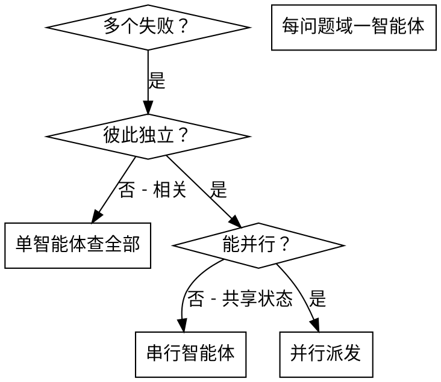

# 并行派发智能体

## 概述

将任务委托给上下文隔离的专业智能体。通过精确编写指令与上下文，使其保持专注并成功完成任务。它们不应继承你会话的上下文或历史——你只构造它们需要的内容。这也为你保留上下文以做协调。

当你有多个互不相关的失败（不同测试文件、不同子系统、不同 bug）时，串行排查浪费时间。每次排查彼此独立，可以并行进行。

**核心原则：** 每个独立问题域派一个智能体，让它们并发工作。

## 何时使用



**适用于：**
- 3+ 个测试文件失败且根因不同  
- 多个子系统独立损坏  
- 每个问题可在不了解其他问题的情况下理解  
- 调查之间无共享状态  

**不适用于：**
- 失败彼此相关（修一个可能修好别的）  
- 需要理解完整系统状态  
- 智能体会互相干扰  

## 模式

### 1. 划分独立域

按「什么坏了」分组失败：
- 文件 A 的测试：工具审批流  
- 文件 B 的测试：批处理完成行为  
- 文件 C 的测试：中止功能  

各域独立——修审批不会影响中止测试。

### 2. 创建聚焦的智能体任务

每个智能体获得：
- **明确范围：** 一个测试文件或子系统  
- **明确目标：** 让这些测试通过  
- **约束：** 不要改其他代码  
- **期望输出：** 发现与修复的摘要  

### 3. 并行派发

```typescript
// 在 Claude Code / AI 环境中
Task("修复 agent-tool-abort.test.ts 的失败")
Task("修复 batch-completion-behavior.test.ts 的失败")
Task("修复 tool-approval-race-conditions.test.ts 的失败")
// 三者并发运行
```

### 4. 审阅与整合

智能体返回后：
- 阅读各摘要  
- 确认修复不冲突  
- 运行完整测试套件  
- 整合全部改动  

## 智能体提示结构

好的智能体提示具备：
1. **聚焦** — 一个清晰的问题域  
2. **自包含** — 理解问题所需的全部上下文  
3. **输出明确** — 智能体应返回什么？  

```markdown
修复 src/agents/agent-tool-abort.test.ts 中 3 个失败测试：

1. "should abort tool with partial output capture" — 期望消息中含 'interrupted at'
2. "should handle mixed completed and aborted tools" — 快工具被中止而非完成
3. "should properly track pendingToolCount" — 期望 3 个结果却得到 0

这些是时序/竞态问题。你的任务：

1. 阅读测试文件，理解每个测试验证什么  
2. 找根因——时序问题还是真 bug？  
3. 修复方式：
   - 用基于事件的等待替代任意超时  
   - 若发现中止实现有 bug 则修复  
   - 若测试的是已变行为则调整期望  

不要只靠加大超时——找到真正原因。

返回：你发现与修复的摘要。
```

## 常见错误

**❌ 太泛：** 「修所有测试」——智能体迷失  
**✅ 具体：** 「修 agent-tool-abort.test.ts」——范围清晰  

**❌ 无上下文：** 「修竞态」——不知道在哪  
**✅ 有上下文：** 粘贴错误信息与测试名  

**❌ 无约束：** 可能重构一切  
**✅ 有约束：** 「不要改生产代码」或「只修测试」  

**❌ 输出模糊：** 「修好它」——不知改了什么  
**✅ 输出明确：** 「返回根因与改动摘要」  

## 何时不要用

**相关失败：** 修一个可能修好别的——先一起排查  
**需要全局上下文：** 需要看到整个系统  
**探索式调试：** 还不清楚哪里坏了  
**共享状态：** 会互相干扰（改同一文件、争用同一资源）  

## 会话中的真实示例

**场景：** 大规模重构后 3 个文件共 6 个测试失败  

**失败：**
- agent-tool-abort.test.ts：3 个（时序）  
- batch-completion-behavior.test.ts：2 个（工具未执行）  
- tool-approval-race-conditions.test.ts：1 个（执行次数 = 0）  

**判断：** 独立域——中止逻辑、批完成、竞态彼此分离  

**派发：**
```
智能体 1 → 修 agent-tool-abort.test.ts
智能体 2 → 修 batch-completion-behavior.test.ts
智能体 3 → 修 tool-approval-race-conditions.test.ts
```

**结果：**
- 智能体 1：用基于事件的等待替代超时  
- 智能体 2：修复事件结构 bug（threadId 位置错误）  
- 智能体 3：增加等待异步工具执行完成  

**整合：** 修复彼此独立、无冲突，全绿  

**节省时间：** 3 个问题并行解决，而非串行  

## 主要收益

1. **并行** — 多项调查同时进行  
2. **聚焦** — 每个智能体范围窄，上下文更少  
3. **独立** — 互不干扰  
4. **速度** — 3 个问题用约 1 倍时间解决  

## 验证

智能体返回后：
1. **审阅各摘要** — 理解改了什么  
2. **检查冲突** — 是否改了同一处代码？  
3. **跑全量套件** — 确认修复可共存  
4. **抽查** — 智能体也可能犯系统性错误  

## 实际影响

来自调试会话（2025-10-03）：
- 3 个文件共 6 个失败  
- 并行派发 3 个智能体  
- 调查并发完成  
- 整合成功  
- 智能体改动零冲突  
