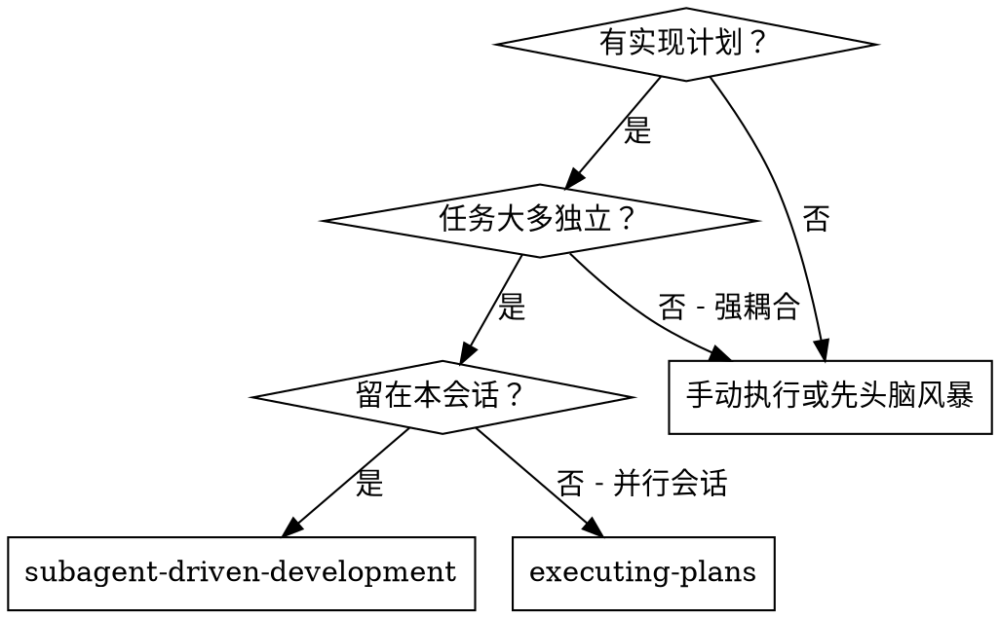
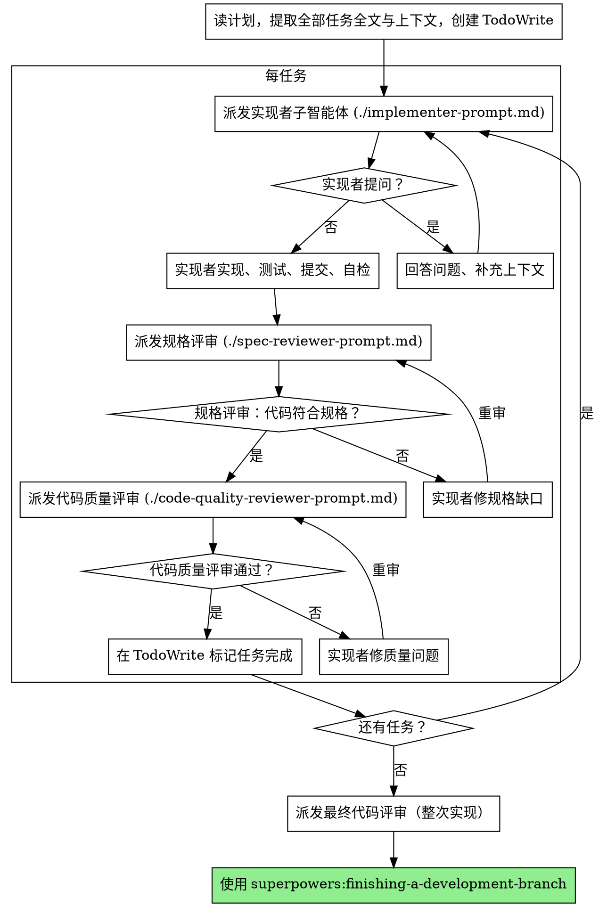

# 子智能体驱动开发

每个任务派发全新子智能体，每任务后两阶段评审：先规格符合性，再代码质量。

**为何用子智能体：** 将任务委托给上下文隔离的专业智能体。通过精确编写指令与上下文，使其保持专注并成功完成任务。它们不应继承你会话的上下文或历史——你只提供它们需要的内容。这也为你保留上下文做协调。

**核心原则：** 每任务新子智能体 + 两阶段评审（规格再质量）= 高质量、快迭代  

## 何时使用



**与 Executing Plans（并行会话）对比：**
- 同一会话（无上下文切换）  
- 每任务新子智能体（无污染）  
- 每任务后两阶段评审：先规格符合，再代码质量  
- 迭代更快（任务间无需人类介入）  

## 流程



## 模型选择

为每个角色选**刚好够用**的模型，以省成本、提速度。

**机械实现任务**（孤立函数、规格清楚、1–2 个文件）：用快而便宜的模型。计划写得清楚时，多数实现任务都很机械。

**整合与判断任务**（多文件协调、模式匹配、调试）：用标准模型。

**架构、设计与评审任务**：用能力最强的可用模型。

**任务复杂度信号：**
- 动 1–2 个文件且规格完整 → 便宜模型  
- 多文件、有整合顾虑 → 标准模型  
- 需要设计判断或广泛理解代码库 → 最强模型  

## 处理实现者状态

实现者子智能体回报四种状态之一，分别处理：

**DONE：** 进入规格符合性评审。

**DONE_WITH_CONCERNS：** 完成但有疑虑。读疑虑再继续。若涉正确性或范围，评审前先处理；若是观察（如「文件变大」），记下再进入评审。

**NEEDS_CONTEXT：** 缺少未提供的信息。补上下文后重新派发。

**BLOCKED：** 无法完成任务。评估阻塞：
1. 若是上下文问题，补上下文后用同模型重派  
2. 若需更强推理，换更强模型重派  
3. 若任务太大，拆小  
4. 若计划本身错误，升级给人类  

**绝不**无视升级或不变更就强令同模型重试。实现者说卡住，就必须有东西改变。

## 提示模板

- `./implementer-prompt.md` — 派发实现者  
- `./spec-reviewer-prompt.md` — 派发规格符合性评审  
- `./code-quality-reviewer-prompt.md` — 派发代码质量评审  

## 示例工作流

```
你：我用子智能体驱动开发执行此计划。

[一次性读计划：docs/superpowers/plans/feature-plan.md]
[提取全部 5 个任务的全文与上下文]
[用 TodoWrite 列出全部任务]

任务 1：安装 hook 脚本

[取任务 1 全文与上下文（已提取）]
[派发实现子智能体，附任务全文+上下文]

实现者：「开始前——hook 应装到用户级还是系统级？」

你：「用户级（~/.config/superpowers/hooks/）」

实现者：「明白。开始实现……」
[稍后] 实现者：
  - 实现 install-hook 命令
  - 测试 5/5 通过
  - 自检：漏了 --force，已补上
  - 已提交

[派发规格符合性评审]
规格评审：✅ 符合规格——需求全满足，无多余

[取 git SHA，派发代码质量评审]
代码评审：优点：测试好、结构清。问题：无。通过。

[标记任务 1 完成]

任务 2：恢复模式

[取任务 2……]
……

[全部任务后]
[派发最终 code-reviewer]
终审：需求全满足，可合并

完成！
```

## 优势

**相对手动执行：**
- 子智能体自然遵循 TDD  
- 每任务新上下文（不混淆）  
- 可并行安全（子智能体互不干扰）  
- 子智能体可在工作前**与工作中**提问  

**相对 Executing Plans：**
- 同一会话（无交接）  
- 持续进展（无需等待）  
- 评审检查点自动  

**效率：**
- 无反复读文件开销（控制者提供全文）  
- 控制者精选所需上下文  
- 子智能体 upfront 信息完整  
- 问题在开工前暴露（而非事后）  

**质量闸：**
- 自检在交接前抓问题  
- 两阶段评审：规格 + 质量  
- 评审循环确保修复真有效  
- 规格符合防止多做/少做  
- 代码质量确保实现扎实  

**成本：**
- 子智能体调用更多（每任务实现者 + 2 个评审）  
- 控制者前期准备更多（预先提取全部任务）  
- 评审循环增加轮次  
- 但能早期发现问题（比后期调试便宜）  

## 危险信号

**绝不：**
- 未经用户明确同意在 main/master 上开始实现  
- 跳过评审（规格 **或** 质量）  
- 未修复问题就继续  
- 并行派发多个实现子智能体（会冲突）  
- 让子智能体读计划文件（应提供全文）  
- 跳过场景设定（子智能体需知任务在整体中的位置）  
- 无视子智能体问题（答完再让其继续）  
- 规格符合「差不多就行」（评审有问题 = 未完成）  
- 跳过评审循环（评审有问题 = 实现者修 = 再评）  
- 用实现者自检代替真实评审（两者都要）  
- **规格未 ✅ 就开始代码质量评审**（顺序错误）  
- 任一评审仍有问题就进入下一任务  

**若子智能体提问：**
- 清楚完整地回答  
- 需要时补充上下文  
- 不要催着赶进实现  

**若评审发现问题：**
- 实现者（同一子智能体流程）修复  
- 评审再评  
- 重复直到通过  
- 不要跳过重审  

**若子智能体任务失败：**
- 另派修复子智能体并给明确指令  
- 不要手动乱改（污染上下文）  

## 衔接

**所需工作流技能：**
- **superpowers:using-git-worktrees** — **必选**：开始前建立隔离工作区  
- **superpowers:writing-plans** — 生成本技能执行的计划  
- **superpowers:requesting-code-review** — 评审子智能体用的模板  
- **superpowers:finishing-a-development-branch** — 全部任务完成后收尾  

**子智能体应使用：**
- **superpowers:test-driven-development** — 每任务遵循 TDD  

**替代工作流：**
- **superpowers:executing-plans** — 用并行会话代替本会话执行  
