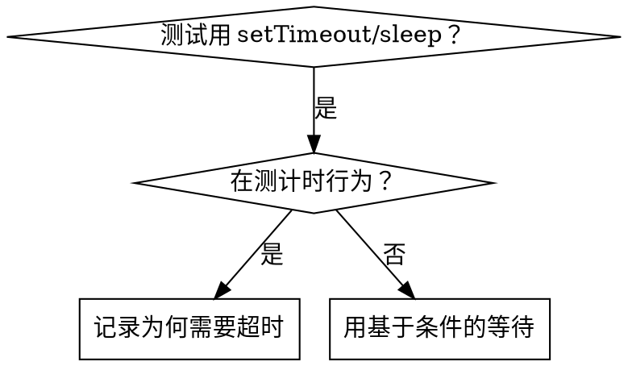

# 基于条件的等待

## 概述

不稳定测试常用任意延时猜时间，造成竞态：快机器过、负载或 CI 下失败。

**核心原则：** 等待你**真正关心的条件**，而不是猜要等多久。

## 何时使用



**适用于：**
- 测试里有任意延时（`setTimeout`、`sleep`、`time.sleep()`）  
- 测试不稳定（有时过、负载下失败）  
- 并行跑时超时  
- 等异步操作完成  

**不适用于：**
- 测的是真实计时行为（防抖、节流间隔）  
- 若必须用任意超时，**写明原因**  

## 核心模式

```typescript
// ❌ 之前：猜时间
await new Promise(r => setTimeout(r, 50));
const result = getResult();
expect(result).toBeDefined();

// ✅ 之后：等条件
await waitFor(() => getResult() !== undefined);
const result = getResult();
expect(result).toBeDefined();
```

## 速查模式

| 场景 | 模式 |
|----------|---------|
| 等事件 | `waitFor(() => events.find(e => e.type === 'DONE'))` |
| 等状态 | `waitFor(() => machine.state === 'ready')` |
| 等数量 | `waitFor(() => items.length >= 5)` |
| 等文件 | `waitFor(() => fs.existsSync(path))` |
| 复杂条件 | `waitFor(() => obj.ready && obj.value > 10)` |

## 实现

通用轮询：

```typescript
async function waitFor<T>(
  condition: () => T | undefined | null | false,
  description: string,
  timeoutMs = 5000
): Promise<T> {
  const startTime = Date.now();

  while (true) {
    const result = condition();
    if (result) return result;

    if (Date.now() - startTime > timeoutMs) {
      throw new Error(`Timeout waiting for ${description} after ${timeoutMs}ms`);
    }

    await new Promise(r => setTimeout(r, 10)); // 每 10ms 轮询
  }
}
```

完整实现（含领域辅助函数 `waitForEvent`、`waitForEventCount`、`waitForEventMatch`）见本目录 `condition-based-waiting-example.ts`（来自真实调试会话）。

## 常见错误

**❌ 轮询太勤：** `setTimeout(check, 1)` — 浪费 CPU  
**✅ 修正：** 每 10ms  

**❌ 无超时：** 条件永远不满足会死循环  
**✅ 修正：** 始终带超时与清晰错误  

**❌ 陈旧数据：** 循环外缓存状态  
**✅ 修正：** 循环内调用 getter 取最新值  

## 何时任意超时才是对的

```typescript
// 工具每 100ms tick ——需要 2 个 tick 验证部分输出
await waitForEvent(manager, 'TOOL_STARTED'); // 先：等条件
await new Promise(r => setTimeout(r, 200));   // 再：等计时行为
// 200ms = 100ms 间隔下的 2 个 tick ——有注释说明理由
```

**要求：**
1. 先等到触发条件  
2. 基于**已知**时序（不是猜）  
3. 注释说明**为什么**  

## 实际影响

调试会话（2025-10-03）：
- 修复 3 个文件中 15 个不稳定测试  
- 通过率：60% → 100%  
- 执行时间：快约 40%  
- 消除竞态  
