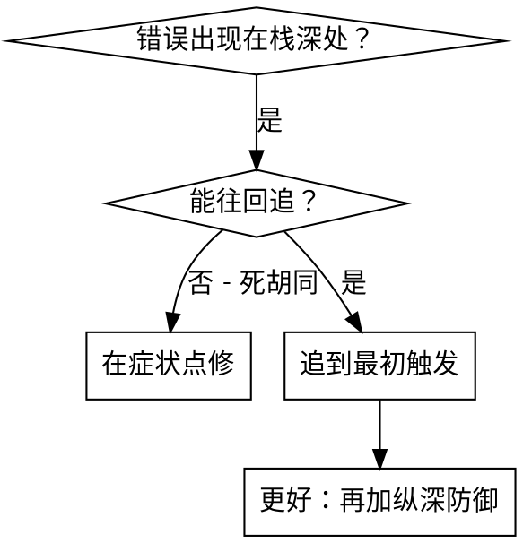
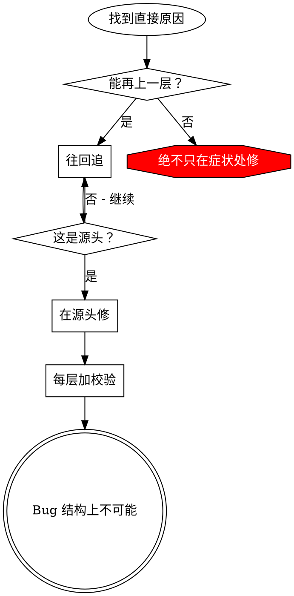

# 根因回溯

## 概述

Bug 常常深埋在调用栈里（在错误目录 git init、文件建错位置、数据库用错路径打开）。本能是在报错处修，但那是在治症状。

**核心原则：** 沿调用链**往回**追到最初触发点，在**源头**修复。

## 何时使用



**适用于：**
- 错误发生在执行深处（非入口）  
- 栈很深  
- 不清楚无效数据从哪来  
- 要找哪个测试/代码触发问题  

## 回溯过程

### 1. 观察症状
```
Error: git init failed in /Users/jesse/project/packages/core
```

### 2. 找直接原因
**什么代码直接导致？**
```typescript
await execFileAsync('git', ['init'], { cwd: projectDir });
```

### 3. 问：谁调用了这个？
```typescript
WorktreeManager.createSessionWorktree(projectDir, sessionId)
  → Session.initializeWorkspace()
  → Session.create()
  → 测试里 Project.create()
```

### 4. 继续往上
**传进来什么值？**
- `projectDir = ''`（空字符串！）
- 空字符串作 `cwd` 会解析成 `process.cwd()`
- 那就是源码目录！

### 5. 找最初触发
**空字符串从哪来？**
```typescript
const context = setupCoreTest(); // 返回 { tempDir: '' }
Project.create('name', context.tempDir); // 在 beforeEach 之前就访问了！
```

## 加栈信息

手动追不动时，加埋点：

```typescript
async function gitInit(directory: string) {
  const stack = new Error().stack;
  console.error('DEBUG git init:', {
    directory,
    cwd: process.cwd(),
    nodeEnv: process.env.NODE_ENV,
    stack,
  });

  await execFileAsync('git', ['init'], { cwd: directory });
}
```

**关键：** 测试里用 `console.error()`（不要用可能被吞的 logger）

**运行并抓取：**
```bash
npm test 2>&1 | grep 'DEBUG git init'
```

**分析栈：**
- 找测试文件名  
- 找触发行号  
- 找模式（同一测试？同一参数？）  

## 找出哪个测试在「污染」

若测试期间出现现象但不知道哪个测试：

用本目录二分脚本 `find-polluter.sh`：

```bash
./find-polluter.sh '.git' 'src/**/*.test.ts'
```

逐个跑测试，停在第一个污染者。用法见脚本注释。

## 实例：空的 projectDir

**症状：** 在 `packages/core/`（源码）下出现 `.git`

**链：**
1. `git init` 在 `process.cwd()` 跑 ← 空 cwd 参数  
2. WorktreeManager 被传入空 projectDir  
3. Session.create() 传入空串  
4. 测试在 beforeEach 前访问 `context.tempDir`  
5. setupCoreTest() 初始返回 `{ tempDir: '' }`  

**根因：** 顶层变量在 beforeEach 前访问了空值  

**修复：** tempDir 改为 getter，在 beforeEach 前访问会抛错  

**同时加深防御：**
- 第 1 层：Project.create() 校验目录  
- 第 2 层：WorkspaceManager 校验非空  
- 第 3 层：NODE_ENV 守卫，禁止在 tmp 外 git init  
- 第 4 层：git init 前打栈日志  

## 关键原则



**绝不只在报错点修。** 回溯到最初触发点。

## 栈技巧

**测试里：** 用 `console.error()` 不用可能被抑制的 logger  
**在危险操作前：** 在失败**前**打日志，不是失败后  
**带上下文：** 目录、cwd、环境变量、时间戳  
**抓栈：** `new Error().stack` 显示完整链  

## 实际影响

调试会话（2025-10-03）：
- 经 5 层回溯找到根因  
- 在源头修（getter 校验）  
- 加 4 层防御  
- 1847 测试通过，零污染  
