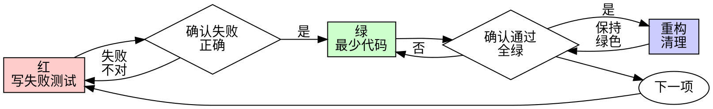

# 测试驱动开发（TDD）

## 概述

先写测试。看它失败。写最少代码通过。

**核心原则：** 若你没看到测试失败，就不知道它测的是不是对的东西。

**违反规则的字面，就是违反规则的精神。**

## 何时使用

**始终：**
- 新功能  
- Bug 修复  
- 重构  
- 行为变更  

**例外（问伙伴）：**
- 一次性原型  
- 生成代码  
- 配置文件  

想「就这一次跳过 TDD」？停。那是合理化。

## 铁律

```
没有先失败的测试，就没有生产代码
```

先写实现再写测试？删掉。重来。

**没有例外：**
- 不要留作「参考」  
- 不要边写测试边「改编」它  
- 不要看它  
- 删就是删  

从测试出发全新实现。句号。

## 红-绿-重构



### 红 — 写失败测试

写一个最小测试，描述应该怎样行为。

<Good>
```typescript
test('retries failed operations 3 times', async () => {
  let attempts = 0;
  const operation = () => {
    attempts++;
    if (attempts < 3) throw new Error('fail');
    return 'success';
  };

  const result = await retryOperation(operation);

  expect(result).toBe('success');
  expect(attempts).toBe(3);
});
```
名称清楚，测真实行为，只测一件事
</Good>

<Bad>
```typescript
test('retry works', async () => {
  const mock = jest.fn()
    .mockRejectedValueOnce(new Error())
    .mockRejectedValueOnce(new Error())
    .mockResolvedValueOnce('success');
  await retryOperation(mock);
  expect(mock).toHaveBeenCalledTimes(3);
});
```
名称含糊，测的是 mock 不是代码
</Bad>

**要求：**
- 一种行为  
- 名称清楚  
- 真实代码（除非不得已不用 mock）

### 验证红 — 看它失败

**强制。绝不跳过。**

```bash
npm test path/to/test.test.ts
```

确认：
- 测试失败（不是抛错跑歪）  
- 失败信息与预期一致  
- 因缺少功能而失败（不是笔误）  

**测试通过了？** 你在测已有行为。修测试。

**测试报错？** 修报错，重跑到「正确失败」。

### 绿 — 最少代码

写能通过测试的最简代码。

<Good>
```typescript
async function retryOperation<T>(fn: () => Promise<T>): Promise<T> {
  for (let i = 0; i < 3; i++) {
    try {
      return await fn();
    } catch (e) {
      if (i === 2) throw e;
    }
  }
  throw new Error('unreachable');
}
```
刚好够通过
</Good>

<Bad>
```typescript
async function retryOperation<T>(
  fn: () => Promise<T>,
  options?: {
    maxRetries?: number;
    backoff?: 'linear' | 'exponential';
    onRetry?: (attempt: number) => void;
  }
): Promise<T> {
  // YAGNI
}
```
过度设计
</Bad>

不要加功能、重构无关代码，或超出测试「改进」。

### 验证绿 — 看它通过

**强制。**

```bash
npm test path/to/test.test.ts
```

确认：
- 测试通过  
- 其他测试仍通过  
- 输出干净（无错、无警告级问题）  

**测试失败？** 修代码，不是修测试。

**其他测试失败？** 现在修。

### 重构 — 清理

仅在变绿之后：
- 去重  
- 改进命名  
- 抽取辅助函数  

保持测试绿色。不加行为。

### 重复

下一项功能的下一个失败测试。

## 好测试

| 质量 | 好 | 差 |
|---------|------|-----|
| **最小** | 一件事。名称里有「并且」？拆开。 | `test('validates email and domain and whitespace')` |
| **清楚** | 名称描述行为 | `test('test1')` |
| **表达意图** | 展示期望的 API | 掩盖代码应做什么 |

## 为何顺序重要

**「实现后再写测试验证」**

实现后写的测试一上来就通过。立即通过什么也证明不了：
- 可能测错对象  
- 可能测实现而非行为  
- 可能漏掉你忘了的边界  
- 你没看到它抓住 bug  

测试先行强迫你看到失败，证明测试真在测东西。

**「我已经手动测过所有边界」**

手动测试是随意的。你以为都测了，但：
- 没有记录  
- 代码变了不能重跑  
- 压力下容易忘  
- 「我当时试过了」≠ 全面  

自动化测试是系统的，每次同样跑法。

**「删掉 X 小时工作是浪费」**

沉没成本谬误。时间已经没了。你现在只能选：
- 删掉用 TDD 重写（再花 X 小时，信心高）  
- 留着后补测试（30 分钟，信心低，多半有 bug）  

「浪费」是保留不可信的代码。无真实测试能跑的工作代码是技术债。

**「TDD 教条，务实要变通」**

TDD **就是**务实：
- 提交前抓 bug（比上线后快）  
- 防回归（一坏马上测出来）  
- 文档化行为（测试展示怎么用）  
- 便于重构（大胆改，测试兜底）  

「务实」捷径 = 线上调试 = 更慢。

**「后补测试目标一样——重精神不重仪式」**

不。后补回答「这代码做什么？」先行回答「**应该**做什么？」

后补会被实现带偏。你测的是你写的，不是需求。你验证记得的边界，不是发现的边界。

先行强迫在实现前发现边界。后补验证你记得一切（你并没有）。

后补 30 分钟 ≠ TDD。你有覆盖率，失去「测试真有效」的证明。

## 常见合理化

| 借口 | 事实 |
|--------|---------|
| 「太简单不用测」 | 简单代码也会坏。测只要 30 秒。 |
| 「我等会再测」 | 一上来就通过的测试什么也证明不了。 |
| 「后补目标一样」 | 后补 =「这做什么？」先行 =「应该做什么？」 |
| 「已经手动测过」 | 随意 ≠ 系统。无记录，不能重跑。 |
| 「删 X 小时浪费」 | 沉没成本。留着未验证代码是债。 |
| 「留着参考，先写测试」 | 你会改编它 = 后补。删就是删。 |
| 「需要先探索」 | 可以。扔掉探索，从 TDD 开始。 |
| 「测试难写 = 设计不清」 | 听测试的。难测 = 难用。 |
| 「TDD 拖慢我」 | TDD 比调试快。务实 = 先行。 |
| 「手动更快」 | 手动证明不了边界。每次改都要重测。 |
| 「旧代码没测试」 | 你在改进它。给旧代码补测试。 |

## 危险信号 — 停，重来

- 先写代码再写测试  
- 实现后才写测试  
- 测试一上来就通过  
- 说不清测试为何失败  
- 「以后再补」测试  
- 「就这一次」合理化  
- 「我已经手动测过」  
- 「后补目的一样」  
- 「重精神不重仪式」  
- 「留着参考」或「改编现有代码」  
- 「已经花了 X 小时，删了浪费」  
- 「TDD 教条，我务实」  
- 「这次不一样因为……」  

**以上全部意味着：删代码。用 TDD 重来。**

## 示例：修 Bug

**Bug：** 接受空邮箱

**红**
```typescript
test('rejects empty email', async () => {
  const result = await submitForm({ email: '' });
  expect(result.error).toBe('Email required');
});
```

**验证红**
```bash
$ npm test
FAIL: expected 'Email required', got undefined
```

**绿**
```typescript
function submitForm(data: FormData) {
  if (!data.email?.trim()) {
    return { error: 'Email required' };
  }
  // ...
}
```

**验证绿**
```bash
$ npm test
PASS
```

**重构**
若有多字段校验可抽取。

## 验证清单

标记完成工作前：

- [ ] 每个新函数/方法有测试  
- [ ] 实现前看到每个测试失败  
- [ ] 每次失败原因符合预期（缺功能，不是笔误）  
- [ ] 对每个测试写了最少实现  
- [ ] 全部测试通过  
- [ ] 输出干净（无错、无警告）  
- [ ] 测试用真实代码（除非不得已不用 mock）  
- [ ] 边界与错误有覆盖  

不能全勾？你跳过了 TDD。重来。

## 卡住时

| 问题 | 做法 |
|---------|----------|
| 不知怎么测 | 写期望的 API。先写断言。问伙伴。 |
| 测试太复杂 | 设计太复杂。简化接口。 |
| 必须全 mock | 耦合太重。用依赖注入。 |
| 搭建巨大 | 抽辅助。仍复杂？简化设计。 |

## 与调试衔接

发现 bug？写失败测试复现。走 TDD 循环。测试证明修复并防回归。

没有测试不要修 bug。

## 测试反模式

加 mock 或测试工具时，阅读 @testing-anti-patterns.md，避免常见坑：
- 测 mock 行为而非真实行为  
- 给生产类加仅测试用的方法  
- 未理解依赖就 mock  

## 最后规则

```
生产代码 → 存在对应测试且该测试曾先失败
否则 → 不是 TDD
```

未经伙伴许可，没有例外。
