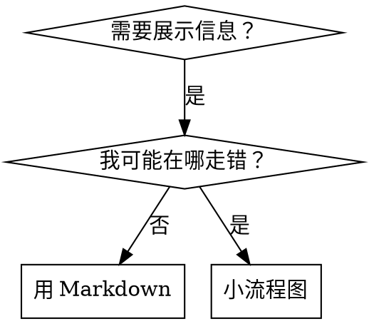

# 撰写技能

## 概述

**撰写技能就是把测试驱动开发用在流程文档上。**

**个人技能放在各智能体专用目录（Claude Code：`~/.claude/skills`，Codex：`~/.agents/skills/`）**

你写测试用例（带子智能体的压力场景），看它失败（基线行为），写技能（文档），再看测试通过（智能体遵守），再重构（堵漏洞）。

**核心原则：** 若你没看到没有技能时智能体如何失败，就不知道技能是否在教对的东西。

**必读背景：** 使用本技能前**必须**理解 superpowers:test-driven-development。该技能定义红-绿-重构循环；本技能把 TDD 适配到文档。

**官方指南：** Anthropic 官方技能撰写最佳实践见 anthropic-best-practices.md。该文档提供与本文 TDD 导向互补的模式与准则。

## 什么是技能？

**技能**是经过验证的技术、模式或工具的参考指南，帮助未来的 Claude 找到并应用有效做法。

**技能是：** 可复用技术、模式、工具、参考手册  

**技能不是：** 你某次如何解决问题的故事  

## 技能与 TDD 的对应

| TDD 概念 | 技能撰写 |
|-------------|----------------|
| **测试用例** | 带子智能体的压力场景 |
| **生产代码** | 技能文档（SKILL.md） |
| **测试失败（红）** | 无技能时智能体违反规则（基线） |
| **测试通过（绿）** | 有技能时智能体遵守 |
| **重构** | 堵漏洞同时保持遵守 |
| **先写测试** | 写技能**之前**先跑基线场景 |
| **看它失败** | 记录智能体原话合理化借口 |
| **最少代码** | 写技能针对那些具体违规 |
| **看它通过** | 验证智能体现在遵守 |
| **重构循环** | 发现新合理化 → 堵上 → 再验证 |

整个技能创建过程遵循红-绿-重构。

## 何时创建技能

**应创建：**
- 技巧对你并不直观  
- 你会在多个项目中再次引用  
- 模式通用（非项目专属）  
- 他人也能受益  

**不要为以下创建：**
- 一次性方案  
- 别处已有标准文档的实践  
- 项目约定（写进 CLAUDE.md）  
- 可用正则/校验强制执行的机械约束（能自动化就自动化——文档留给需要判断的事）

## 技能类型

### 技术（Technique）
有步骤的具体方法（condition-based-waiting、root-cause-tracing）

### 模式（Pattern）
思考问题的方式（flatten-with-flags、test-invariants）

### 参考（Reference）
API、语法、工具文档（如 Office 文档）

## 目录结构

```
skills/
  skill-name/
    SKILL.md              # 主参考（必填）
    supporting-file.*     # 仅在需要时
```

**扁平命名空间** — 所有技能在同一可搜索空间

**拆成单独文件适用于：**
1. **厚重参考**（100+ 行）— API、完整语法  
2. **可复用工具** — 脚本、模板  

**保留在正文：**
- 原则与概念  
- 代码模式（< 50 行）  
- 其余能内联则内联  

## SKILL.md 结构

**Frontmatter（YAML）：**
- 必填两项：`name` 与 `description`（全部字段见 [agentskills.io/specification](https://agentskills.io/specification)）
- 合计最多 1024 字符  
- `name`：仅用字母、数字、连字符（无括号等特殊字符）  
- `description`：第三人称，**只**写何时使用（不写做什么）
  - 以「Use when...」开头，聚焦触发条件  
  - 写具体症状、情境、上下文  
  - **绝不**概括技能流程（原因见 CSO）  
  - 可能的话控制在 500 字符内  

```markdown
---
name: Skill-Name-With-Hyphens
description: Use when [具体触发条件与症状]
---

# 技能名称

## 概述
是什么？1–2 句核心原则。

## 何时使用
[若非显而易见，用小流程图]

症状与用例的条目列表
何时不要用

## 核心模式（技术/模式类）
前后代码对比

## 速查
表格或要点，便于扫读

## 实现
简单模式内联代码
厚重参考或可复用工具用链接

## 常见错误
易错点 + 修复

## 实际影响（可选）
具体结果
```

## Claude 搜索优化（CSO）

**可发现性关键：** 未来的 Claude 要**找到**你的技能

### 1. 丰富的 description

**目的：** Claude 用 description 判断「现在该不该读这个技能」。要回答：「我现在该读它吗？」

**格式：** 以「Use when...」开头，聚焦触发条件

**关键：description = 何时用，不是技能做什么**

description **只**应描述触发条件。**不要**在 description 里概括流程。

**原因：** 测试表明，若 description 概括了工作流，Claude 可能只跟 description 而不读全文。写「任务间做代码评审」会让 Claude 只做**一次**评审，尽管流程图清楚画了**两次**（先规格符合，再代码质量）。

改成仅「Use when executing implementation plans with independent tasks」（无流程概括）后，Claude 会正确读流程图并执行两阶段评审。

**陷阱：** 概括流程的 description 会成为捷径；正文变成 Claude 会跳过的「文档」。

```yaml
# ❌ 差：概括流程——Claude 可能照做而不读技能
description: Use when executing plans - dispatches subagent per task with code review between tasks

# ❌ 差：过程细节过多
description: Use for TDD - write test first, watch it fail, write minimal code, refactor

# ✅ 好：仅触发条件，无流程概括
description: Use when executing implementation plans with independent tasks in the current session

# ✅ 好：仅触发条件
description: Use when implementing any feature or bugfix, before writing implementation code
```

**内容要点：**
- 用具体触发、症状、情境表明技能适用  
- 描述**问题**（竞态、行为不一致），不要只写**语言层症状**（setTimeout、sleep）  
- 除非技能本身技术绑定，否则触发条件保持与技术无关  
- 若技能技术相关，在触发里写清楚  
- 第三人称（注入系统提示）  
- **绝不概括流程**

```yaml
# ❌ 差：太抽象，没写何时用
description: For async testing

# ❌ 差：第一人称
description: I can help you with async tests when they're flaky

# ❌ 差：提到技术但技能并不专精于此
description: Use when tests use setTimeout/sleep and are flaky

# ✅ 好：以 Use when 开头，描述问题，无流程
description: Use when tests have race conditions, timing dependencies, or pass/fail inconsistently

# ✅ 好：技术相关技能，触发明确
description: Use when using React Router and handling authentication redirects
```

### 2. 关键词覆盖

用 Claude 会搜的词：
- 错误信息：「Hook timed out」「ENOTEMPTY」「race condition」  
- 症状：「flaky」「hanging」「zombie」「pollution」  
- 同义：「timeout/hang/freeze」「cleanup/teardown/afterEach」  
- 工具：真实命令、库名、文件类型  

### 3. 描述性命名

**主动、动词在前：**
- ✅ `creating-skills` 而非 `skill-creation`  
- ✅ `condition-based-waiting` 而非 `async-test-helpers`  

### 4. Token 效率（关键）

**问题：** getting-started 与高频引用技能会进入**每一次**对话，每个 token 都珍贵。

**目标字数：**
- getting-started 工作流：每项 <150 词  
- 高频加载技能：总计 <200 词  
- 其他技能：<500 词（仍要简洁）  

**技巧：**

**细节移到工具 --help：**
```bash
# ❌ 差：在 SKILL.md 里写全参数
search-conversations supports --text, --both, --after DATE, --before DATE, --limit N

# ✅ 好：指向 --help
search-conversations 支持多种模式与过滤。运行 --help 查看详情。
```

**用交叉引用：**
```markdown
# ❌ 差：重复工作流
搜索时，派发子智能体并套模板……
[重复 20 行]

# ✅ 好：引用其他技能
始终用子智能体（省 50–100 倍上下文）。必选：用 [other-skill-name] 处理工作流。
```

**压缩示例：**
```markdown
# ❌ 差：啰嗦（42 词）
伙伴：「我们以前在 React Router 里怎么处理认证错误？」
你：我会搜索历史对话里 React Router 认证模式……
[派发子智能体，查询「React Router authentication error handling 401」]

# ✅ 好：极简（约 20 词）
伙伴：「React Router 里认证错误怎么处理？」
你：正在搜索……
[派发子智能体 → 综合]
```

**去掉冗余：**
- 不要重复交叉引用技能里已有的内容  
- 不要解释命令本身已显然的事  
- 不要堆多个同模式示例  

**验证：**
```bash
wc -w skills/path/SKILL.md
# getting-started 工作流：目标每项 <150 词
# 其他高频：目标总计 <200 词
```

**按「你做什么」或核心洞见命名：**
- ✅ `condition-based-waiting` > `async-test-helpers`  
- ✅ `using-skills` 而非 `skill-usage`  

**动名词（-ing）适合流程：**
- `creating-skills`、`testing-skills`、`debugging-with-logs`  
- 主动，描述你在做的动作  

### 4. 交叉引用其他技能

**文档里引用其他技能时：**

只用技能名，并标明是否必选：
- ✅ `**必选子技能：** 使用 superpowers:test-driven-development`  
- ✅ `**必读背景：** 你必须理解 superpowers:systematic-debugging`  
- ❌ `见 skills/testing/test-driven-development`（是否必选不清）  
- ❌ `@skills/testing/test-driven-development/SKILL.md`（强制加载，烧上下文）  

**为何不用 @：** `@` 会立刻整文件加载，在需要前就消耗 20 万+ token。

## 流程图使用



**仅在以下情况用流程图：**
- 不明显的决策点  
- 可能过早停下的流程循环  
- 「何时用 A 而非 B」  

**不要用于：**
- 参考材料 → 表格、列表  
- 代码示例 → Markdown 代码块  
- 线性步骤 → 编号列表  
- 无语义标签（step1、helper2）  

样式规则见 @graphviz-conventions.dot。

**给伙伴可视化：** 本目录 `render-graphs.js` 可把技能里的图渲染成 SVG：
```bash
./render-graphs.js ../some-skill           # 各图分开
./render-graphs.js ../some-skill --combine # 合并一张 SVG
```

## 代码示例

**一个精彩示例胜过许多平庸示例**

选最贴切语言：
- 测试技巧 → TypeScript/JavaScript  
- 系统调试 → Shell/Python  
- 数据处理 → Python  

**好示例：** 可运行、注释讲清**为何**、来自真实场景、模式清晰、便于改写（非空模板）

**不要：** 五种语言各一份、填空模板、生硬例子

你擅长移植——一个顶级示例足够。

## 文件组织

### 自包含技能
```
defense-in-depth/
  SKILL.md    # 全在内联
```
适用：内容都能放下，无需厚重参考

### 带可复用工具的技能
```
condition-based-waiting/
  SKILL.md    # 概述 + 模式
  example.ts  # 可改编的实用辅助
```
适用：工具是可复用代码，而非仅叙述

### 带厚重参考的技能
```
pptx/
  SKILL.md       # 概述 + 工作流
  pptxgenjs.md   # 600 行 API
  ooxml.md       # 500 行 XML
  scripts/       # 可执行工具
```
适用：参考太大不宜内联

## 铁律（与 TDD 相同）

```
没有先失败的测试，就没有技能
```

适用于**新技能**与**对现有技能的编辑**。

先写技能再测？删掉。重来。  
改技能不测？同样违规。

**没有例外：**
- 不是「小改动就可以」  
- 不是「只加一节」  
- 不是「只是文档更新」  
- 不要把未测改动当「参考」  
- 不要边跑测试边「改编」  
- 删就是删  

**必读背景：** superpowers:test-driven-development 解释为何如此。文档同理。

## 测试各类技能

不同类型需要不同测法：

### 纪律类技能（规则/要求）

**例：** TDD、verification-before-completion、先设计后编码  

**测法：**
- 学术题：是否理解规则？  
- 压力场景：压力下是否遵守？  
- 多重压力组合：时间 + 沉没成本 + 疲惫  
- 记录合理化并写明确反驳  

**成功标准：** 最大压力下仍遵守规则  

### 技术类技能（操作指南）

**例：** condition-based-waiting、root-cause-tracing、防御式编程  

**测法：**
- 应用场景：能否正确应用？  
- 变体场景：边界是否处理？  
- 信息缺失：说明是否有缺口？  

**成功标准：** 在新场景下成功应用技术  

### 模式类技能（心智模型）

**例：** 降复杂度、信息隐藏  

**测法：**
- 识别场景：是否知道何时适用？  
- 应用：能否用该模型？  
- 反例：是否知道何时**不要**用？  

**成功标准：** 正确判断何时、如何应用  

### 参考类技能（文档/API）

**例：** API、命令、库指南  

**测法：**
- 检索：能否找到正确信息？  
- 应用：能否正确使用？  
- 缺口：常见用例是否覆盖？  

**成功标准：** 找到并正确应用参考信息  

## 跳过测试的常见借口

| 借口 | 事实 |
|--------|---------|
| 「技能显然很清楚」 | 对你清楚 ≠ 对其他智能体清楚。要测。 |
| 「只是参考」 | 参考也可能有缺口、含糊节。要测检索。 |
| 「测试小题大做」 | 未测技能几乎总有毛病。测 15 分钟省几小时。 |
| 「有问题再测」 | 问题 = 智能体用不了技能。部署**前**测。 |
| 「测起来太烦」 | 比线上调坏技能省心。 |
| 「我有信心」 | 过度自信必出问题。照样测。 |
| 「学术审阅够了」 | 读 ≠ 用。要测应用场景。 |
| 「没时间测」 | 部署坏技能以后修更费时间。 |

**以上全部意味着：部署前要测。没有例外。**

## 让技能抗合理化

像 TDD 这类纪律技能要抗合理化。智能体很聪明，压力下会找漏洞。

**心理备注：** 理解说服技巧**为何**有效，有助于系统运用。研究基础见 persuasion-principles.md（Cialdini, 2021；Meincke et al., 2025）：权威、承诺、稀缺、社会认同、一体感等。

### 显式堵死每条漏洞

不要只陈述规则——要禁止具体绕法：

<Bad>
```markdown
先写代码再写测试？删掉。
```
</Bad>

<Good>
```markdown
先写代码再写测试？删掉。重来。

**没有例外：**
- 不要留作「参考」
- 不要边写测试边「改编」
- 不要看它
- 删就是删
```
</Good>

### 应对「精神 vs 字面」

尽早加入基础原则：

```markdown
**违反条文的字面，就是违反条文的精神。**
```

切断整类「我遵循精神」的借口。

### 建合理化表

从基线测试收集借口（见下文测试）。智能体说的每个借口都进表：

```markdown
| 借口 | 事实 |
|--------|---------|
| 「太简单不用测」 | 简单代码也会坏。测只要 30 秒。 |
| 「我等会再测」 | 一上来就通过什么也证明不了。 |
| 「后补一样」 | 后补问「这做什么」，先行问「应该做什么」。 |
```

### 列危险信号

让智能体自我检查是否在合理化：

```markdown
## 危险信号 — 停，重来

- 先写代码再写测试
- 「我已经手动测过」
- 「后补目的一样」
- 「重精神不重仪式」
- 「这次不一样因为……」

**以上全部意味着：删代码。用 TDD 重来。**
```

### 为「即将违规」更新 CSO

在 description 里加入**即将**违反时的症状：

```yaml
description: use when implementing any feature or bugfix, before writing implementation code
```

## 技能的红-绿-重构

遵循 TDD 循环：

### 红：写失败测试（基线）

**不带技能**用子智能体跑压力场景。记录确切行为：
- 选了什么？  
- 用了哪些合理化（原话）？  
- 哪些压力触发违规？  

这就是「看它失败」——写技能前必须看到智能体自然表现。

### 绿：写最少技能

写技能针对那些具体合理化。不要为假想情况加多余内容。

**带技能**跑同样场景。智能体应遵守。

### 重构：堵漏洞

发现新合理化？加明确反驳。再测到刀枪不入。

**测试方法：** 完整方法见 @testing-skills-with-subagents.md：
- 如何写压力场景  
- 压力类型（时间、沉没成本、权威、疲惫）  
- 系统堵洞  
- 元测试技巧  

## 反模式

### ❌ 叙事例子
「2025-10-03 那次会话我们发现空 projectDir……」  
**差：** 太具体，不可复用  

### ❌ 多语言稀释
example-js.js、example-py.py、example-go.go  
**差：** 质量平庸、维护负担  

### ❌ 流程图里塞代码
```dot
step1 [label="import fs"];
```
**差：** 不能复制，难读  

### ❌ 泛标签
helper1、step3  
**差：** 标签要有语义  

## 停：进入下一技能前

**写完任一技能后必须停下，完成部署流程。**

**不要：**
- 批量创建多个技能却不逐个测试  
- 当前技能未验证就进入下一个  
- 因为「批量更高效」就跳过测试  

**下文部署清单对每一技能都是强制的。**

部署未测技能 = 部署未测代码。违背质量标准。

## 技能创建清单（TDD 改编）

**重要：用 TodoWrite 为下列每一项建待办。**

**红阶段 — 写失败测试：**
- [ ] 创建压力场景（纪律类至少 3 种压力组合）
- [ ] **不带技能**运行——逐字记录基线行为
- [ ] 归纳合理化/失败模式

**绿阶段 — 写最少技能：**
- [ ] 名称仅用字母、数字、连字符（无括号等）
- [ ] YAML 含必填 `name`、`description`（最多 1024 字符；见 [规范](https://agentskills.io/specification)）
- [ ] description 以「Use when...」开头，含具体触发/症状
- [ ] description 第三人称
- [ ] 全文可搜索关键词（错误、症状、工具）
- [ ] 清晰概述与核心原则
- [ ] 针对红阶段具体失败点
- [ ] 代码内联 **或** 链到单独文件
- [ ] 一个绝佳示例（不要多语言堆砌）
- [ ] **带技能**跑场景——验证遵守

**重构阶段 — 堵漏洞：**
- [ ] 从测试中识别**新**合理化
- [ ] 加明确反驳（纪律类）
- [ ] 合并各轮测试的合理化表
- [ ] 列危险信号
- [ ] 再测到刀枪不入

**质量检查：**
- [ ] 仅在不明显时用小型流程图
- [ ] 速查表
- [ ] 常见错误节
- [ ] 无叙事故事
- [ ] 辅助文件仅用于工具或厚重参考

**部署：**
- [ ] 提交到 git 并推送到你的 fork（若已配置）
- [ ] 若通用可考虑上游 PR  

## 发现工作流

未来 Claude 如何找到你的技能：

1. **遇到问题**（「测试不稳定」）  
2. **找到 SKILL**（description 匹配）  
3. **扫概述**（是否相关？）  
4. **读模式**（速查表）  
5. **加载示例**（仅在实现时）  

**为此流程优化**——尽早、尽可能多放可搜索词。

## 底线

**创建技能就是给流程文档做 TDD。**

同一铁律：没有先失败的测试就没有技能。  
同一循环：红（基线）→ 绿（写技能）→ 重构（堵洞）。  
同一收益：质量更好、意外更少、结果更硬。

代码用 TDD，技能也用 TDD。同一套纪律用在文档上。
